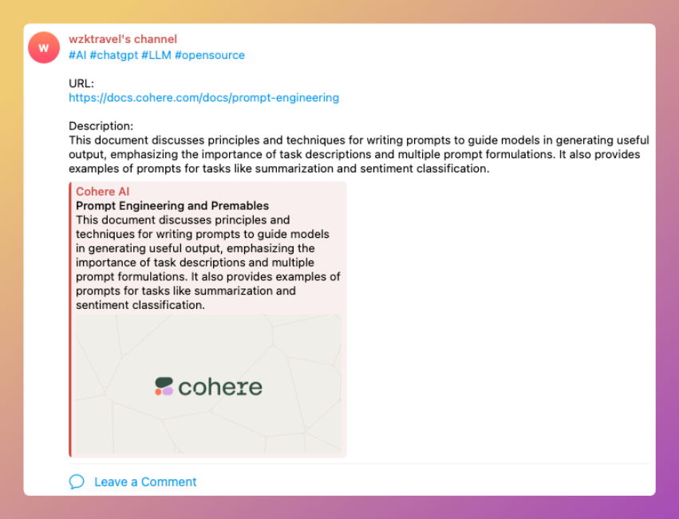

# Wise Favorites Worker

一个提供网络收藏、AI 标签分类、跨平台分享的方案，部署在 Cloudflare workers 上。

**功能**

1. 方便快捷收藏自己喜欢的网络内容
2. 使用 AI 给收藏打标签
3. 快速分享到 Telegram

**TODO**

1. 自动下载网页内容
   1. 网页快照，离线阅读
   2. 导出为 markdown，pdf 等格式
   3. AI 总结，提取关键内容
2. 与收藏的内容进行对话

## 使用

1. clone 此项目，将`wrangler.toml.sample`复制为`wrangler.toml`，然后修改配置
2. 执行`pnpm run deploy`部署到 cloudflare workers 中，部署完成后留意给出的 workers 地址。

提供最基本的 API 方式，在此基础上根据场景有很多不同玩法。

### API 方式

```shell
$ curl --request POST \
    --url https://${your cloudlfare path}/api/favorite \
    --header 'Authorization: Bearer ${your token}' \
    --header 'Content-Type: application/json' \
    --data '{
      "url": "https://docs.cohere.com/docs/prompt-engineering"
    }'
```

结果示例：

```json
{
  "code": 0,
  "msg": "succeeded",
  "data": {
    "title": "Prompt Engineering and Premables",
    "description": "This document discusses principles and techniques for writing prompts to guide models in generating useful output, emphasizing the importance of task descriptions and multiple prompt formulations. It also provides examples of prompts for tasks like summarization and sentiment classification.",
    "image": "https://files.readme.io/06afae0-cohere_meta_image.jpg",
    "url": "https://docs.cohere.com/docs/prompt-engineering",
    "tags": ["AI", "chatgpt", "LLM", "dev"],
    "shared": {
      "telegram": true,
      "d1": true
    }
  }
}
```

发送到 telegram 中效果如下



### 快捷指令

在 iPhone 上使用时，可以借助快捷指令实现。

1. 添加此快捷指令 [Share to Telegram](https://www.icloud.com/shortcuts/615b96ec27ed483f8b53bfeb117927a1)
2. 将第二个操作中地址改为你的地址，例如：https://wise-favorites.xxx.wokers.dev/api/favorite
3. 将 Header 中 Authorization 值改为`Bearer ${your token}`，注意空格。
4. 点击完成，在 Safari 或 Twitter 分享中下拉可以找到`Share to Telegram`项。第一次使用，会出现发送请求的授权，点击始终允许即可。

### Chrome 浏览器插件

使用 [https://github.com/ethan4768/wise-favorites-extension](https://github.com/ethan4768/wise-favorites-extension)

## 配置

通过 `wrangler.toml` 进行配置

### AUTH

API 调用时会进行认证，**注意 token 不要泄露**。

配置项：`vars.BEARER_TOKENS`

### 预设的 tag 列表

chatgpt 会从此预设列表中选择最相关的 2-5 个返回

配置项：`vars.TAGS`

### 网页信息抓取

使用的是 [LinkPreview](https://www.linkpreview.net/)，此服务提供免费计划，无须信用卡，个人使用足够。

1. 注册登录
2. 生成 ACCESS KEY
3. 将 ACCESS KEY 填充到 `vars.LINKPREVEW.API_KEY` 中

### OpenAI

配置项在`[vars.OPENAI]`下，

```
API_KEY = "changethis"
BASE_PATH = "https://api.openai.com/v1"
MODEL = "gpt-4-0125-preview"
```

### Telegram

配置项在`[vars.TELEGRAM]`下，不配置`BOT_TOKEN`或`CHANNEL_ID`时，不进行发送，只返回结果。

- BOT_TOKEN: 通过 BotFather 创建 Bot，BotFather 会提供一个 token，API 请求需要使用该 token。
- CHANNEL_ID:
  - 如果 channel 是公开的，那么它的 id 就是它的用户名（例如 @mychannel）；
  - 如果 channel 是私有的，那么需要使用一些工具或者 API 来获取它的 id。

## 实现逻辑

首先，获取此链接的一些 meta 信息，然后将这些信息喂给 chatgpt，由 chatgpt 找出与预设 tag 相关度最高的 2-5 个 tag 并返回。最后，将内容发送到 telegram 指定频道中。

预设的提示词为

```
What tags would you suggest me to add to this post? Select 2-5 items with the highest relevance from the list: {preset_tags} \n{format_instructions}\n{post}
```

其中

- `preset_tags`，预设的 tag 列表，配置在`wrangler.toml`中；
- `format_instructions`，由 langchain parser 进行填充，这里使用的是`CommaSeparatedListOutputParser`，返回一个格式化的 tag 列表
- `post`，通过 url 获取到的网页信息

根据我的使用情况，每次请求会消耗 200 到 300 个 token。

## 使用的技术&服务

### 托管

- Cloudflare worker

### 技术栈

- hono：简易的前端框架
- Langchain：与 OpenAI 交互，并进行结构化输出

### 三方服务

- [LinkPreview](https://www.linkpreview.net/) 抓取页面内容
