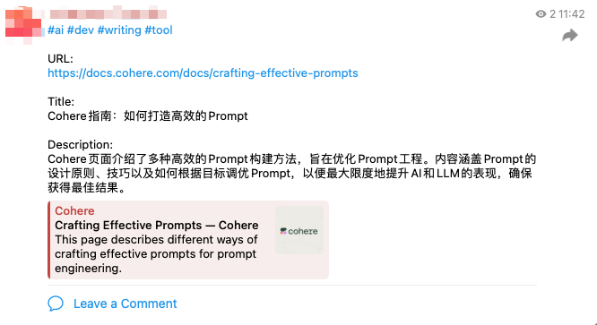

# Wise Favorites Worker

一个提供网络收藏、AI 标签分类、跨平台分享的方案，部署在 Cloudflare workers 上。

## 功能

1. 通过 API 方便快捷收藏自己喜欢的网络内容
2. 根据 URL 获取网页基本信息，title, description, ogImage 等
3. 借助大模型给收藏打标签
4. 分享到 telegram
    - twitter 会实现 instant view 效果
5. 同步到 github

同步到 github 后，可参考 [https://github.com/ethan4768/blog](https://github.com/ethan4768/blog) 实现以下功能

1. [x] 自动下载网页内容，使用
2. [x] AI 总结，提取关键内容
3. [x] 自动发布到博客
4. [ ] 与收藏的内容进行对话

## 部署

1. clone 此项目，将`wrangler.toml.sample`复制为`wrangler.toml`，然后修改配置
2. 执行`pnpm run deploy`部署到 cloudflare workers 中，部署完成后留意给出的 workers 地址
3. 根据需要配置自定义域名

### Telegram

配置项在`[vars.TELEGRAM]`下，任意一项不配置时，不进行推送。

1. BOT_TOKEN: 通过 BotFather 创建 Bot，BotFather 会提供一个 token，API 请求需要使用该 token。
2. CHANNEL_ID:
    - 如果 channel 是公开的，那么它的 id 就是它的用户名（例如 @mychannel）；
    - 如果 channel 是私有的，那么需要使用一些工具或者 API 来获取它的 id。

### Github

配置项在`[vars.GITHUB]`下，任意一项不配置时，不进行推送。

**权限**
为安全隔离考虑，尽量创建新的 [personal access token](https://github.com/settings/personal-access-tokens/new)

1. 为了权限最小化，可以指定 repo
2. repo 权限设置，将 Actions, Contents, Workflows 三项设置为 **Read and write**

## 使用

提供 API，在此基础上根据场景有很多不同玩法

### API 方式

```shell
curl --request POST \
  --url https://${your cloudlfare path}/api/favorite \
  --header 'Authorization: Bearer ${your token}' \
  --header 'Content-Type: application/json' \
  --data '{
	"url": "https://docs.cohere.com/docs/prompt-engineering",
	"options": {
      "arsp": false,
      "share": {
        "telegram": false,
        "github": false
      }
	}
  }'
```

结果示例：

```json
{
  "code": 0,
  "msg": "succeeded",
  "data": {
    "url": "https://docs.cohere.com/docs/crafting-effective-prompts",
    "title": "高效提示词的制作：Cohere 实用指南",
    "slug": "crafting-effective-prompts",
    "description": "本页面介绍了多种制作高效提示词的方法，帮助用户在提示工程中获得最佳结果。无论是针对 AI、聊天机器人还是其他自然语言处理模型，掌握这些技巧将显著提升交互的质量和效率。",
    "arsp": false,
    "image": "https://fdr-prod-docs-files-public.s3.amazonaws.com/cohere.docs.buildwithfern.com/2024-11-07T21:19:13.731Z/assets/images/f1cc130-cohere_meta_image.jpg",
    "tags": [
      "ai",
      "tool",
      "writing",
      "chatgpt",
      "llm"
    ],
    "shared": {
      "telegram": false,
      "github": false
    },
    "timestamp": "2024-11-08T03:39:13.902Z"
  }
}
```

telegram 中效果：



### 快捷指令

在 iPhone 上使用时，可以借助快捷指令实现。

1. 添加此快捷指令 [Share to Telegram](https://www.icloud.com/shortcuts/615b96ec27ed483f8b53bfeb117927a1)
2. 将第二个操作中地址改为你的地址，例如：https://wise-favorites.xxx.wokers.dev/api/favorite
3. 将 Header 中 Authorization 值改为`Bearer ${your token}`，注意空格。
4. 点击完成，在 Safari 或 Twitter 分享中下拉可以找到`Share to Telegram`项。第一次使用，会出现发送请求的授权，点击始终允许即可。

### Chrome 浏览器插件

使用 [https://github.com/ethan4768/wise-favorites-extension](https://github.com/ethan4768/wise-favorites-extension)

## 实现逻辑

1. 获取此链接的一些 meta 信息
2. 将这些信息喂给 LLM，由 LLM 返回 tags, slug, improved_title, improved_description
3. 推送到 Telegram, github 等

根据我的使用情况，每次请求会消耗 200 到 300 个 token。

## 使用的技术&服务

- Cloudflare Worker，托管
- [Hono](https://hono.dev/)：简易的前端框架
- [LinkPreview](https://www.linkpreview.net/) 抓取页面内容，此服务提供免费计划，无须信用卡，个人使用足够。
